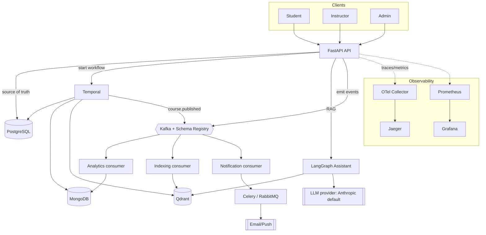
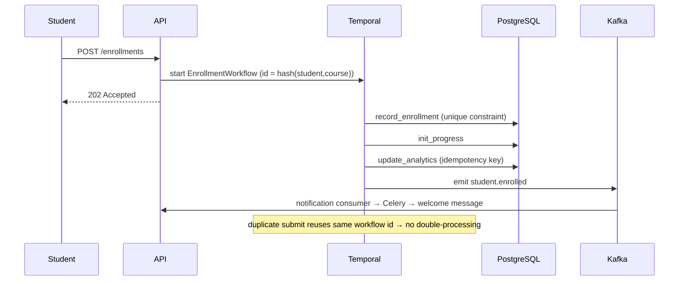
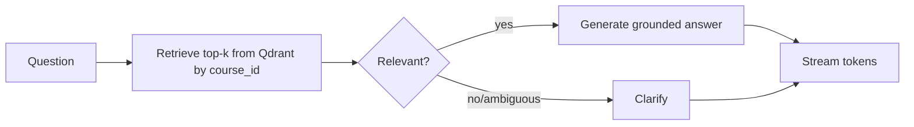

# SmartCourse — Product Requirements Document (PRD)

| | |
|---|---|
| **Product** | SmartCourse — Intelligent Course Delivery Platform |
| **Owner** | EduCorp Platform Engineering |
| **Author** | Backend team |
| **Status** | Draft v1.0 |
| **Last updated** | 2026-07-02 |
| **Related docs** | [CLAUDE.md](../CLAUDE.md) (architecture), [README.md](../README.md) (run guide) |

---

## 1. Overview

### 1.1 Problem statement
EduCorp serves universities, enterprises, and training academies. Rapid growth in learners
and instructors has exposed five limitations in the current system:

1. **Slow, manual content publishing** — instructors cannot launch/update courses quickly.
2. **Poor discoverability** — no intelligent search or contextual learning assistance.
3. **Scattered, inconsistent data** — dashboards disagree with the real platform state.
4. **Traffic-driven delays** — enrollments, notifications, and background jobs pile up under load.
5. **Underused interaction data** — rich signals aren't leveraged for learning enhancement.

### 1.2 Vision
A backend that makes course lifecycle operations fast and reliable, keeps learner data
consistent and durable, delivers an AI learning assistant, and scales to tens of thousands of
concurrent learners with background workflows that survive failure.

### 1.3 Goals & non-goals

**Goals**
- Robust course & user management with reliable enrollment rules.
- A scalable operations backbone (publishing, indexing, analytics, notifications).
- Consistent, durable, queryable learner state (enrollments, progress, completions, certificates).
- An intelligent assistant: contextual Q&A + instructor content generation.
- Real-time-feeling interactions where long work runs asynchronously.
- Observability across every critical flow.

**Non-goals (this phase)**
- Frontend/UI, mobile apps, or LTI/SSO integrations.
- Billing/payments and marketplace features.
- Live video/synchronous classrooms.
- Multi-region active-active deployment (single-region first; design must not preclude it).

### 1.4 Success metrics
- Course publish → "ready" p95 within target SLA with **zero** partial-publish corruption.
- Enrollment path exhibits **exactly-once** business effects (no duplicate enrollments/analytics).
- Assistant answers grounded in retrieved course content with streamed delivery for long output.
- System sustains launch-day enrollment spikes with bounded queue lag and no data loss.
- Every critical flow is traceable end-to-end (trace + metrics + logs).

---

## 2. Personas & key use-cases

### 2.1 Personas
- **Student** — browses, enrolls, learns, tracks progress, asks the assistant questions.
- **Instructor** — creates/updates courses, publishes, generates summaries/quizzes.
- **Admin** — manages users/roles, monitors platform health and analytics.
- **Platform/SRE** — operates the system, diagnoses failures via observability.

### 2.2 Key use-cases

| UC | Actor | Description | Primary components |
|----|-------|-------------|--------------------|
| UC-1 | Instructor | Create/update a course with modules & assets | API, PostgreSQL |
| UC-2 | Instructor | Publish a course → content processed & made searchable | Temporal, Mongo, Qdrant, Kafka |
| UC-3 | Student | Register with a role | API, PostgreSQL |
| UC-4 | Student | Enroll in a course (respecting rules) | Temporal, PostgreSQL, Kafka |
| UC-5 | Student | Track learning progress & completion | PostgreSQL |
| UC-6 | Student | Ask a contextual question about course content | LangGraph, Qdrant, LLM |
| UC-7 | Instructor | Auto-generate summaries/objectives/quizzes (streamed) | LangGraph, LLM |
| UC-8 | System | React to domain events (analytics, indexing, notifications) | Kafka, Celery, Mongo |
| UC-9 | Admin | View analytics metrics & platform health | Mongo read models, Prometheus/Grafana |
| UC-10 | SRE | Diagnose a failed publish/enrollment/assistant flow | OTel, Jaeger, Temporal UI |

---

## 3. Functional requirements

Each requirement has a stable ID used in the traceability matrix (§7).

### FR-1 Course & user management
- **FR-1.1** Create/update courses, modules, and learning assets.
- **FR-1.2** Register users with roles: `student` / `instructor` / `admin`.
- **FR-1.3** Enroll students into courses enforcing rules: no duplicate enrollment,
  enrollment limits/prerequisites, and retained enrollment history.
- **FR-1.4** Every update/enrollment maintains consistency across all system components.

### FR-2 Content publishing workflow
- **FR-2.1** On publish/update, analyze content and break it into modules → lessons → chunks.
- **FR-2.2** Store processed content for fast retrieval, search, and context-based queries.
- **FR-2.3** Mark the course **READY** only after all internal processing completes.
- **FR-2.4** Partial failures must not corrupt the workflow; steps retry in isolation.

### FR-3 Enrollment workflow
- **FR-3.1** Record enrollment.
- **FR-3.2** Initialize progress tracking.
- **FR-3.3** Update analytics to reflect activity.
- **FR-3.4** Trigger notifications (e.g., welcome message).
- **FR-3.5** Guarantee idempotency, backpressure handling, and failure recovery without
  losing user state.

### FR-4 Intelligent learning assistant
- **FR-4.1 (Contextual Q&A)** Retrieve relevant course sections and generate a grounded answer.
- **FR-4.2 (Content enhancement)** Generate summaries/objectives/quiz questions from material.
- **FR-4.3** Support incremental/streamed delivery for long responses.
- **FR-4.4** Behave consistently for incomplete/ambiguous questions (clarify rather than hallucinate).

### FR-5 Distributed & event-driven behaviors
- **FR-5.1** Trigger dependent tasks (content processing, analytics, notifications, Q&A prep)
  independently from main user flows.
- **FR-5.2** Tasks are traceable and recoverable.
- **FR-5.3** Handle failures gracefully; avoid double-processing (idempotency).
- **FR-5.4** Absorb workload spikes (backpressure).

### FR-6 Analytics metrics
Expose and keep accurate: total students, total instructors, total courses published, new
enrollments over time, course completion rate, average time-to-complete, most popular courses,
average courses per student, AI assistant usage (asked/answered/type), and failed
events/workflow issues.

### FR-7 Observability & reliability
- **FR-7.1** Clear separation of responsibilities between components.
- **FR-7.2** Monitoring + logging for all key flows.
- **FR-7.3** Diagnose failures in publishing, enrollment progression, assistant interactions,
  and background tasks.
- **FR-7.4** High consistency and accuracy across all data models.

---

## 4. Non-functional requirements

| ID | Category | Requirement |
|----|----------|-------------|
| NFR-1 | Scalability | Sustain tens of thousands of concurrent learners; API scales horizontally (stateless); workers/consumers scale independently. |
| NFR-2 | Reliability | No data loss or duplication in background pipelines; durable workflows recover after crashes; at-least-once delivery + idempotent effects = effectively exactly-once. |
| NFR-3 | Consistency | PostgreSQL is the single source of truth for transactional state; derived stores (Mongo/Qdrant/analytics) are eventually consistent projections. |
| NFR-4 | Performance | Publish and enroll endpoints return immediately (async work offloaded); assistant streams first token quickly. |
| NFR-5 | Availability | No single background component failure blocks user-facing APIs; graceful degradation. |
| NFR-6 | Observability | Distributed tracing, metrics, and structured logs on every critical flow; dead-letter + failed-event metrics. |
| NFR-7 | Maintainability | Clean layering, dependency inversion, single config source, typed code, lint + type-check in CI. |
| NFR-8 | Testability | Unit + integration + workflow-replay tests; deterministic idempotency tests. |
| NFR-9 | Security | Role-based authorization; secrets via env; input validation via Pydantic. |
| NFR-10 | Portability | Entire stack reproducible via Docker Compose; provider-agnostic LLM layer. |
| NFR-11 | Extensibility | New event consumers/workflows/LLM providers added without touching core flows. |

---

## 5. Architecture

### 5.1 Responsibility model (the three async mechanisms)
- **Temporal** — durable, multi-step, must-not-corrupt orchestration (publishing, enrollment).
- **Kafka + Schema Registry** — domain-event backbone decoupling reactions from main flows.
- **Celery + RabbitMQ** — discrete fire-and-forget side effects (single notification, re-index).

> Rule: *orchestrated & durable → Temporal; broadcast a fact → Kafka; one-shot side effect → Celery.*

### 5.2 Data ownership
- **PostgreSQL** — source of truth: users, courses, modules, enrollments, progress, certificates.
- **MongoDB** — content documents (modules→lessons→chunks) + denormalized analytics read models.
- **Qdrant** — vector store (`course_chunks`), RAG retrieval filtered by `course_id`.
- **Redis** — cache, rate limiting, idempotency/dedupe keys, Celery result backend.

### 5.3 System diagram



### 5.4 Content publishing workflow (FR-2)

```mermaid
sequenceDiagram
    participant I as Instructor
    participant API
    participant T as Temporal
    participant Mongo
    participant Qdrant
    participant PG as PostgreSQL
    participant K as Kafka
    I->>API: POST /courses/{id}/publish
    API->>T: start ContentPublishingWorkflow(course_id)
    API-->>I: 202 Accepted (returns immediately)
    T->>T: extract_content (retryable)
    T->>Mongo: chunk_content (store chunks)
    T->>T: embed_chunks
    T->>Qdrant: index_chunks (upsert vectors)
    T->>PG: mark_ready (status = READY)
    T->>K: emit course.published
    Note over T: any step fails → retry that step only;<br/>course never READY unless all succeed
```

### 5.5 Enrollment workflow (FR-3)



### 5.6 Assistant flow (FR-4)



---

## 6. Implementation timeline & milestones

Sizing assumes iterative delivery; each milestone is independently demoable and testable.

| Milestone | Scope | Key deliverables | Exit criteria |
|-----------|-------|------------------|---------------|
| **M0 — Foundation** ✅ | Infra + scaffold | Docker Compose stack, config, DB clients, project layout, CLAUDE.md, PRD | `make infra` up; `/health` green; docs reviewed |
| **M1 — Course & user management** | FR-1 | ORM models + migrations; user/role registration; course/module/asset CRUD; enrollment rules | CRUD + enrollment-rule tests pass |
| **M2 — Publishing workflow** | FR-2, FR-5 | Temporal `ContentPublishingWorkflow` + activities; Mongo chunk store; Qdrant indexing; READY state; `course.published` event | Publish is crash-safe; partial-failure test passes |
| **M3 — Enrollment workflow** | FR-3, FR-5 | Temporal `EnrollmentWorkflow`; progress init; idempotent analytics; notifications via Kafka→Celery | Duplicate-submit + recovery tests pass |
| **M4 — Event backbone & consumers** | FR-5, FR-6 | Avro schemas + Schema Registry; producer; analytics/indexing/notification consumers; dead-letter + failed-event metric | Consumers idempotent; DLQ verified |
| **M5 — Intelligent assistant** | FR-4 | LangGraph graph (retrieve→grade→generate/clarify); RAG over Qdrant; streamed enhancement endpoints | Grounded answers; streaming works; ambiguity handled |
| **M6 — Analytics & dashboards** | FR-6, FR-7 | Mongo read models for all metrics; Grafana dashboards; assistant-usage metrics | All §FR-6 metrics visible & accurate |
| **M7 — Observability & hardening** | FR-7, NFR-1/2/5/6 | End-to-end tracing on all flows; load test for spikes; failure-injection; backpressure tuning | SLOs met under load test; traces complete |
| **M8 — Quality gate** | NFR-7/8 | Test coverage targets; lint/type-check in CI; architecture & diagram review | Coverage + review sign-off |

---

## 7. Traceability matrix

Features → requirements → deliverables → components (files/services) → verification.

| Feature | Requirements | Milestone | Component(s) | Verification |
|---------|--------------|-----------|--------------|--------------|
| User & role registration | FR-1.2, NFR-9 | M1 | `api/v1/users.py`, `models/`, `db/postgres.py` | Unit + API tests |
| Course/module/asset CRUD | FR-1.1, FR-1.4 | M1 | `api/v1/courses.py`, `models/` | API + consistency tests |
| Enrollment rules (dup/limit/prereq/history) | FR-1.3, FR-1.4 | M1 | `api/v1/enrollments.py`, `models/` | Rule unit tests |
| Content publishing | FR-2.1–2.4, FR-5.* | M2 | `workflows/publishing.py`, `db/mongo.py`, `db/qdrant.py` | Temporal replay + partial-failure test |
| Course READY state | FR-2.3, FR-7.4 | M2 | `workflows/publishing.py`, `models/` | State-transition test |
| Enrollment orchestration | FR-3.1–3.5 | M3 | `workflows/enrollment.py` | Idempotency + recovery test |
| Progress & completion tracking | FR-1.4, FR-3.2, FR-6 | M3 | `models/`, `db/postgres.py` | Unit + analytics reconciliation |
| Domain events | FR-5.1–5.4 | M4 | `events/topics.py`, `events/producer.py` | Schema-compat + ordering test |
| Event consumers (analytics/index/notify) | FR-5.2/5.3, FR-6 | M4 | `events/run_consumers.py`, `tasks/` | Idempotent-consume + DLQ test |
| Notifications | FR-3.4, FR-5.1 | M3/M4 | `tasks/notifications.py`, `tasks/celery_app.py` | Task retry test |
| Contextual Q&A | FR-4.1, FR-4.3, FR-4.4 | M5 | `ai/graph.py`, `ai/retrieval.py`, `ai/llm.py`, `api/v1/assistant.py` | Grounding + ambiguity eval |
| Content enhancement | FR-4.2, FR-4.3 | M5 | `ai/graph.py`, `api/v1/assistant.py` | Streaming test |
| LLM provider abstraction | NFR-10, NFR-11 | M5 | `ai/llm.py` | Provider-swap test |
| Analytics metrics | FR-6, FR-7.4 | M6 | `db/mongo.py`, consumers, Grafana | Metric-accuracy test |
| Failed-events metric | FR-6, FR-5.3 | M4/M6 | consumers (DLQ), Prometheus | DLQ counter assertion |
| Tracing/metrics/logging | FR-7.1–7.3, NFR-6 | M0/M7 | `core/observability.py`, `docker/otel`, `docker/prometheus`, `docker/grafana` | Trace-completeness check |
| Reproducible environment | NFR-10 | M0 | `docker-compose.yml`, `Dockerfile`, `Makefile` | `make infra`/`make up` |
| Scale under load | NFR-1, NFR-4, FR-5.4 | M7 | API, workers, consumers | Load + backpressure test |
| Crash recovery | NFR-2, NFR-5 | M7 | Temporal workflows, consumers | Failure-injection test |

---

## 8. Testing strategy (supports NFR-8, Expected Outcome §6)

- **Unit** — services, enrollment rules, retrieval, provider abstraction.
- **Integration** — API ↔ Postgres/Mongo/Qdrant; consumer ↔ Kafka (testcontainers).
- **Workflow tests** — Temporal replay + activity-failure simulation for publishing/enrollment.
- **Idempotency tests** — duplicate submits and redelivered events produce one effect.
- **Load/backpressure** — enrollment-spike simulation; assert bounded lag, no loss.
- **Assistant evals** — grounding (answers cite retrieved chunks), ambiguity handling, streaming.
- **Quality gates** — `ruff` + `mypy` + coverage threshold enforced in CI.

## 9. Risks & mitigations

| Risk | Impact | Mitigation |
|------|--------|-----------|
| Over-use of Temporal vs Kafka vs Celery | Complexity, wrong guarantees | Enforce §5.1 decision rule in review |
| Derived-store drift (Mongo/Qdrant vs Postgres) | Inconsistent dashboards | Postgres = truth; rebuildable projections from events |
| Duplicate side effects on redelivery | Bad analytics/notifications | Idempotency keys in Redis; unique constraints |
| LLM latency/cost on long generations | Slow UX | Streaming; async offload; provider abstraction |
| Stack operational overhead | Slow onboarding | One-command Compose; CLAUDE.md ownership map |

## 10. Open questions
- Auth/identity source (internal vs enterprise SSO) — deferred, must not block M1 model design.
- Embedding model choice and dimension (affects Qdrant collection config) — decide in M2.
- Notification channels (email/push/in-app) and provider — decide before M3.
- Data retention & PII policy for analytics — decide before M6.
```
